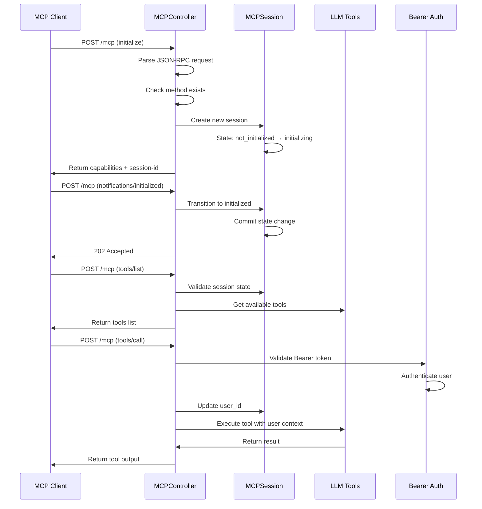
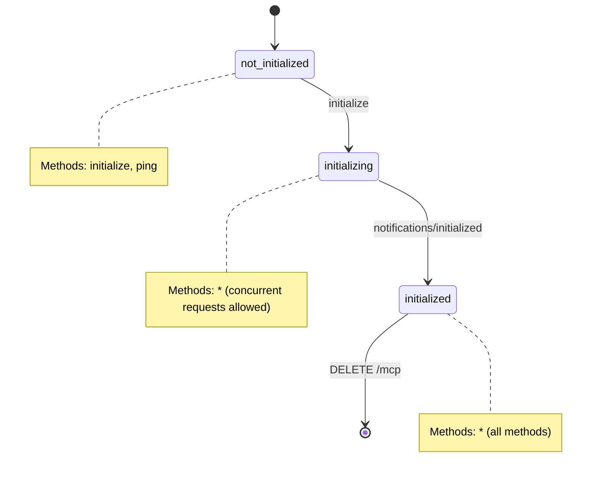

# MCP Server Technical Guide

## Architecture Overview

The MCP server implements a stateful JSON-RPC 2.0 server that bridges MCP clients with Odoo's LLM tool system.

### Core Components

- **MCPController**: HTTP endpoint handler (`/mcp`)
- **MCPSession**: Session state management model
- **MCPServerConfig**: Server configuration model
- **Bearer Auth**: Central OAuth/API-key authentication policy in the MCP dispatcher

## Request Flow

## Session State Machine

## Key Design Decisions

### Concurrent Request Handling

- `initializing` state allows all methods to handle Claude Desktop's parallel discovery requests
- Explicit `session._cr.commit()` ensures immediate state visibility

### Authentication Flow

- **Protected MCP Endpoint** authenticates every protocol request before
  protocol and session validation. An unauthenticated `initialize` therefore
  returns an HTTP 401 Bearer challenge rather than a JSON-RPC error.
- **Protected Operations Only** uses an explicit public allowlist containing
  `initialize`, `notifications/initialized`, and `ping`; every other current or
  future MCP method defaults to protected.
- Bearer authentication accepts OAuth access tokens first and Odoo API keys
  when API-key access is enabled.
- A stateful protected endpoint binds the authenticated user to the session
  when `initialize` creates it.
- Tools execute with authenticated user's Odoo permissions

### Error Handling

- Early method validation prevents unnecessary session lookups
- JSON-RPC 2.0 compliant error responses
- Proper HTTP status codes (200 for JSON-RPC, 400/404 for transport errors)

## Performance Optimizations

1. **Method Existence Check**: `_is_callable()` validates handlers before session operations
2. **Indexed Lookups**: `session_id` field has database index for fast session retrieval
3. **Minimal Logging**: Production mode logs only warnings and authentication events
4. **State Transitions**: Direct database commits prevent race conditions

## Configuration

- **Mode**: Stateful (recommended) vs Stateless
- **Authentication Policy**: Protected endpoint (recommended) vs public
  negotiation with protected operations
- **Protocol Version**: Auto-negotiation with MCP 2025-06-18 support
- **External URL**: Override for Docker/container environments
- **Endpoint Path**: Unique served path (`/mcp` or `/mcp/<name>`)
- **Tools**: All user-visible tools or a per-endpoint allowlist

Multiple active configurations are supported. The request URL resolves the
configuration before protocol validation or authentication. Stateful sessions
store their owning configuration, and OAuth access tokens remain bound to the
canonical resource URL, preventing cross-endpoint reuse.

## Security Model

- Bearer token authentication via OAuth 2.1 or Odoo's `res.users.apikeys`
- HTTP 401 challenges advertise server-specific RFC 9728 metadata only when
  OAuth is enabled
- Protected endpoints must enable at least one authentication mechanism
- User context binding: `request.update_env(user=authenticated_user)`
- ACL enforcement: Tools respect Odoo's permission system
- Session isolation: Each session tracks its endpoint and user context
